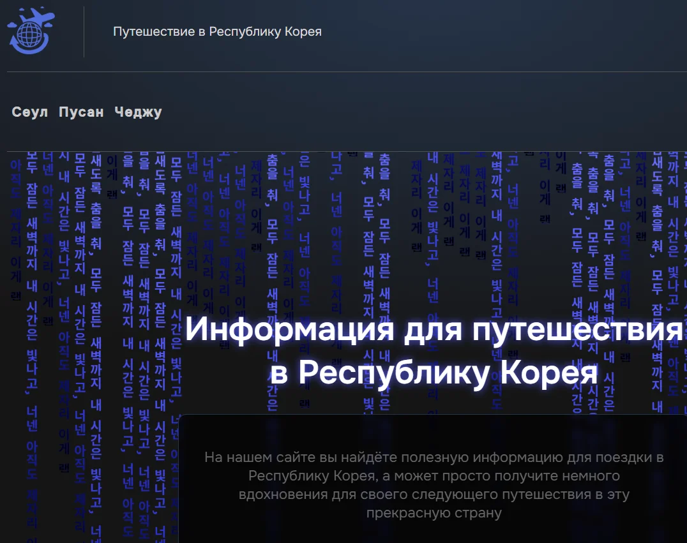

# **my-project 2025 - 2026 by Next**

---

✔️ Next 15\*

✔️ TypeScript 5\*

✔️ React 19\*

✔️ CSS Modules

✔️ Jest

✔️ React Testing Library

✔️ jest-axe

---

## Tests:

В проекте добавлены базовые проверки качества кода и тесты:

✔️ `npm run typecheck` — проверка TypeScript

✔️ `npm run lint` — проверка ESLint/Next.js

✔️ `npm run test` — запуск Jest-тестов

✔️ `npm run build` — production-сборка Next.js

✔️ `npm run check` — общий сценарий: typecheck + lint + test + build

### Что покрыто тестами:

✔️ Проверка внешних ссылок и URL-констант

✔️ Проверка маршрутов городов `/cities/...`, `generateStaticParams` и `notFound()`

✔️ Проверка данных городов, фото, видео и карточек мест

✔️ Component-тесты Header, Footer и Cookie через React Testing Library

✔️ Проверка поведения Header: внутренние ссылки открываются в текущей вкладке, внешние — в новой

✔️ Проверка мобильного меню Header: открытие, закрытие и обработка Escape

✔️ Проверка поведения Modal: закрытие по Escape, overlay click и восстановление scroll-lock

✔️ Accessibility-проверки Cookie, Header, Modal и VideoList через jest-axe

---

## Link:

https://my-project-2025-ten.vercel.app/

---
